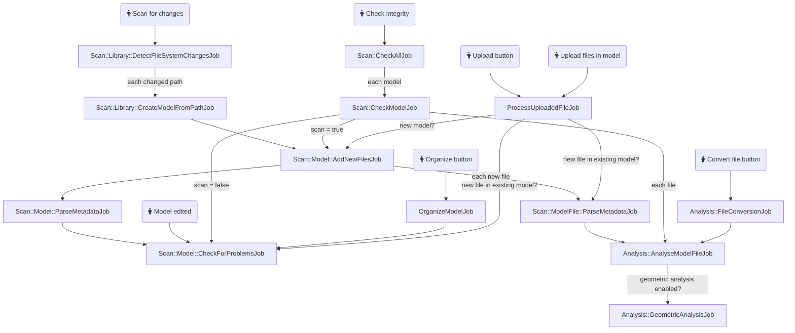

# Scanning jobs

There is a fairly complex tree of jobs that happens when models are scanned, which can also be prompted by various actions.

```mermaid
flowchart TD
    DFS[Scan::Library::DetectFileSystemChangesJob]
    CMFP[Scan::Library::CreateModelFromPathJob]
    ANF[Scan::Model::AddNewFilesJob]
    PM[Scan::Model::ParseMetadataJob]
    PMF[Scan::ModelFile::ParseMetadataJob]
    CFP[Scan::Model::CheckForProblemsJob]
    CA[Scan::CheckAllJob]
    CM[Scan::CheckModelJob]
    OM[OrganizeModelJob]
    PUF[ProcessUploadedFileJob]
    AMF[Analysis::AnalyseModelFileJob]
    FC[Analysis::FileConversionJob]
    GA[Analysis::GeometricAnalysisJob]

    ModelEdit(fa:fa-person Model edited)
    Organize(fa:fa-person Organize button)
    ScanAll(fa:fa-person Scan for changes)
    CheckAll(fa:fa-person Check integrity)
    MainUpload(fa:fa-person Upload button)
    FileUpload(fa:fa-person Upload files in model)
    FileConvert(fa:fa-person Convert file button)

    ScanAll --> DFS
    CheckAll --> CA
    DFS -->|each changed path| CMFP
    CMFP --> ANF
    ANF --> PM
    ANF -->|each new file| PMF
    PM --> CFP
    ModelEdit --> CFP
    PMF --> AMF
    AMF -->|geometric analysis enabled?| GA
    CA -->|each model| CM
    CM -->|scan = true| ANF
    CM -->|scan = false| CFP
    CM -->|each file| AMF
    Organize --> OM
    OM --> CFP
    MainUpload --> PUF
    FileUpload --> PUF
    PUF -->|new model?| ANF
    PUF -->|new file in existing model?| CFP
    PUF -->|new file in existing model?| PMF
    FileConvert --> FC
    FC --> AMF
```
